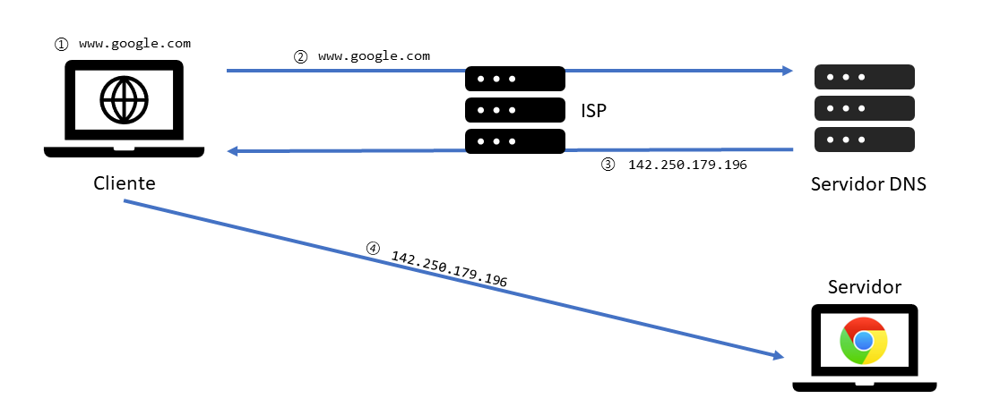
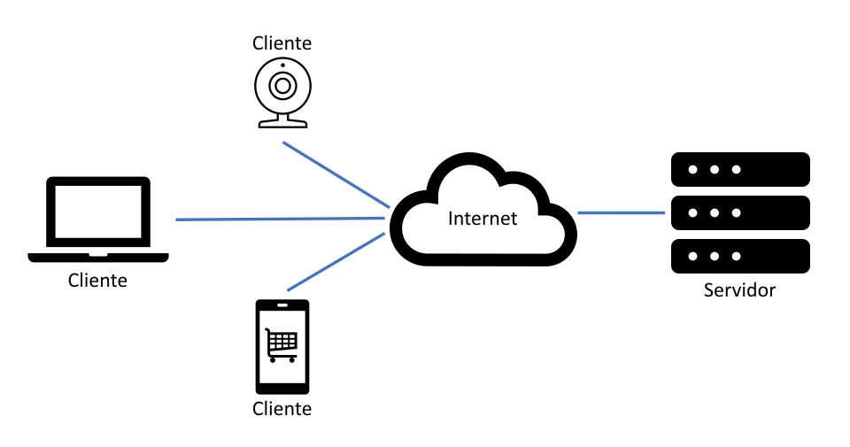
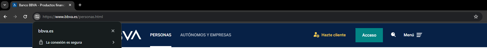

## Diferencia entre Internet y la Web

Es común confundir estos términos, pero se refieren a cosas diferentes:

- **Internet**: Es la red global de computadoras interconectadas que comunican usando el [protocolo de Internet](https://es.wikipedia.org/wiki/Protocolo_de_internet) (IP). Puedes pensar en Internet como la infraestructura global que conecta millones de redes privadas y públicas.

- **Web (_World Wide Web_)**: Es uno de los servicios que operan sobre Internet. La web utiliza el protocolo HTTP para transmitir datos, lo que facilita el acceso a páginas que combinan texto, gráficos y otros tipos de contenido multimedia.

## Sistema de Nombres de Dominios (DNS)

El Sistema de Nombres de Dominio (DNS) es un componente crítico de la infraestructura de Internet. Funciona como el directorio telefónico de Internet, donde en lugar de buscar números de teléfono, buscamos direcciones IP asociadas a [nombres de dominio](https://es.wikipedia.org/wiki/Dominio_de_internet) fáciles de recordar. Vamos a explorar a grandes rasgos cómo funciona este sistema y por qué es tan importante.

### ¿Qué es DNS?

DNS es un sistema que ayuda a traducir nombres de dominio amigables para los humanos, como `www.google.com`, en direcciones IP numéricas, como `142.250.179.132`, que son utilizadas por los ordenadores y otros dispositivos para identificar cada sitio web de manera única en la red.

### ¿Cómo funciona DNS?

1. Cuando escribes `www.google.com` en tu navegador, el navegador primero busca si ya sabe a qué dirección de Internet (IP) corresponde ese nombre, revisando su propia memoria de direcciones recientes, conocida como caché.
2. Si no encuentra la dirección en su caché, el navegador pregunta a un servidor DNS, que es proporcionado por tu proveedor de servicios de Internet ([ISP](https://es.wikipedia.org/wiki/Proveedor_de_servicios_de_internet)). Este servidor sabe donde preguntar para obtener la dirección que corresponde a `www.google.com`.
3. El servidor DNS se comunica con otros servidores específicos que tienen el detalle de direcciones para dominios como `google.com`. Estos servidores envían la dirección IP correcta de `www.google.com` de vuelta a tu ISP.
4. Con la dirección IP recibida, tu navegador puede ahora conectarse directamente al servidor donde está alojado `www.google.com` y mostrarte la página que deseas visitar.

Aunque el proceso pueda parecer largo, ocurre en cuestión de milisegundos, dando acceso rápidamente a cualquier sitio web escribiendo solo su nombre en lugar de recordar direcciones IP complejas.

> ℹ️ Los pasos anteriores ofrecen una visión general simplificada del funcionamiento del Sistema de Nombres de Dominio (DNS) proporcionando una comprensión inicial, sin embargo, el DNS es un sistema complejo con muchos más detalles y consideraciones técnicas, si te interesa una exploración más profunda de cómo funciona el DNS puedes acceder a su [información correspondiente](https://es.wikipedia.org/wiki/Sistema_de_nombres_de_dominio) en la Wikipedia.

## Qué involucra una conexión entre cliente y servidor

Una conexión entre un cliente y un servidor implica varias tecnologías y componentes que trabajan juntos para facilitar la comunicación y el intercambio de datos. Vamos a detallar ligeramente cada uno de estos componentes y su función en el proceso.

### Conexión a Internet

La conexión a Internet es el medio por el cual los datos se transmiten entre el cliente y el servidor.

Sirve como el canal imprescindible para todas las comunicaciones en línea. Obviamente, sin una conexión a Internet, no es posible realizar solicitudes web ni recibir respuestas.

### TCP/IP

[TCP/IP](https://es.wikipedia.org/wiki/Modelo_TCP/IP) (Protocolo de Control de Transmisión/Protocolo de Internet) es el conjunto de normas que rigen la transmisión de datos en Internet. TCP se encarga de descomponer los mensajes en **paquetes**, garantizando su entrega correcta y en orden, y ensamblándolos en el extremo receptor. IP, por su parte, se encarga de dirigir estos paquetes desde el origen hasta el destino.

TCP/IP permite que dispositivos de diferentes redes se comuniquen entre sí garantizando que los datos enviados lleguen íntegros y en secuencia a su correcto destino.

### DNS (Sistema de Nombres de Dominio)

Ya hemos visto anteriormente qué es y cómo funciona DNS. DNS es un sistema que traduce nombres de dominio fáciles de recordar (como [www.google.com](http://www.google.com/)) en direcciones IP numéricas que las máquinas utilizan para identificar y localizar sitios web y servicios en Internet.

### HTTP (Protocolo de Transferencia de Hipertexto)

[HTTP](https://es.wikipedia.org/wiki/Protocolo_de_transferencia_de_hipertexto) es el protocolo utilizado para la transferencia de información en la web. Define cómo se deben formatear y transmitir los mensajes entre clientes y servidores.

HTTP permite la comunicación estandarizada entre clientes y servidores, facilitando el intercambio de documentos de hipertexto (páginas web).

### Archivos y recursos en el servidor

Los archivos de código son los _scripts_ (secuencias de comandos) y documentos que componen un sitio web, incluidos HTML, CSS, y JavaScript. Los recursos, por otro lado, se refiere a imágenes, vídeos, y otros medios que se cargan en el sitio web.

Estos archivos y recursos son los elementos básicos que el servidor entrega al cliente para mostrar y funcionar adecuadamente el sitio web. El navegador del cliente interpreta estos archivos de código para renderizar la página web visible al usuario.

### Ejemplo de una conexión

Imagina que quieres visualizar un vídeo en YouTube:

1. **Introduces la URL en tu navegador:** Aquí actúas como el cliente, iniciando la solicitud.
2. **Tu navegador consulta DNS:** Convierte `www.youtube.com` en la dirección IP correspondiente al servidor de Youtube.
3. **Tu navegador envía una solicitud HTTP al servidor de YouTube:** Utiliza TCP/IP para asegurar la entrega de la solicitud.
4. **El servidor de YouTube procesa la solicitud:** Encuentra el vídeo solicitado y lo prepara para enviar.
5. **El vídeo es enviado de vuelta a tu navegador:** El servidor utiliza HTTP para enviar el vídeo, y TCP se asegura de que los paquetes de datos lleguen en orden y completos.
6. **Tu navegador recibe y muestra el vídeo:** Los archivos de código y recursos se interpretan y procesan para permitirte ver el vídeo.

## Diferencia entre cliente y servidor

Anteriormente hemos mencionado los términos ["cliente" y "servidor"](https://es.wikipedia.org/wiki/Cliente-servidor) pero, ¿Qué significan exactamente estos términos en el contexto de la Web? Exploremos estos roles para entender mejor su relación y funcionamiento.

### Definiciones básicas

**Cliente:** Un cliente es cualquier programa o dispositivo que solicita recursos o servicios a otro sistema en la red, conocido como servidor. En el contexto de la web, un cliente generalmente inicia la comunicación enviando una solicitud que necesita ser procesada por el servidor. Un ejemplo claro es el navegador web que utilizas para visitar sitios en Internet. Cada vez que ingresas una URL, tu navegador actúa como cliente, solicitando la página del servidor web correspondiente.

**Servidor:** Un servidor, por otro lado, es un programa o dispositivo que responde a las solicitudes hechas por los clientes proporcionando los recursos o servicios requeridos. Los servidores están diseñados para estar constantemente disponibles y a la espera de solicitudes para procesarlas. Por ejemplo, el servidor web donde se aloja un sitio web escucha las peticiones de los navegadores de los usuarios y les envía las páginas solicitadas. Los servidores suelen ser computadoras potentes capaces de manejar numerosas solicitudes de clientes de manera simultánea.

### Relación cliente/servidor

- **Cliente:** Tu navegador (Chrome, Firefox, etc.)
- **Servidor:** El servidor web donde está alojado un sitio, como por ejemplo, Wikipedia.
- **Interacción:** Cuando escribes la dirección de Wikipedia en tu navegador, este actúa como cliente enviando una solicitud al servidor de Wikipedia para obtener la página de inicio. El servidor procesa esta solicitud y envía los datos de la página de vuelta a tu navegador.

Pero la relación entre cliente y servidor no se limita a la Web, sino que es un principio en muchas otras aplicaciones de Internet. Veamos cómo funciona esta relación en otro contexto común: el correo electrónico.

- **Cliente:** Aplicación de correo (Outlook, Gmail en navegador, etc.)
- **Servidor:** Servidor de correo electrónico que gestiona los correos entrantes y salientes.
- **Interacción:** Al enviar un correo, tu aplicación de correo electrónico solicita al servidor que transmita tu mensaje al destinatario. El servidor de correo recibe tu mensaje y se encarga de que llegue a su destino.

Pongamos como analogía el ejemplo de un restaurante. Imagina un escenario en el que entras en un restaurante de comida rápida para comer:

- **Cliente:** Tu (el cliente) pides el menú que te apetece al empleado que se encuentra en el mostrador o en la máquina para realizar los pedidos.

- **Servidor:** El pedido se pasa a la cocina (el servidor) donde lo preparan. Una vez que el pedido está listo, te entregan tu pedido solicitado.

En este ejemplo, tu inicias el pedido, llamada solicitud (_request_) y esperas una respuesta (tu pedido), mientras que en la cocina (servidor) procesan nuestra solicitud y responde entregándote el pedido, también llamada respuesta (_response_).

## Qué son los paquetes

Un paquete es una pequeña porción de datos enviada sobre una red. Los paquetes son el medio principal de transporte de datos en redes que utilizan el Protocolo de Internet (IP), como es el caso de Internet. Cada paquete contiene parte de la carga útil (los datos que se necesitan transmitir), así como encabezados que contienen información sobre la transmisión, como la dirección de origen (de donde viene), la dirección de destino (a donde va), el número de secuencia, y otros metadatos que ayudan a la red a entregar correctamente el paquete a su destinatario.

### ¿Cómo se fragmentan los datos?

- Cuando un mensaje grande o un archivo se necesita transmitir a través de una red, se divide en piezas más pequeñas y manejables llamadas paquetes. Esta división se realiza porque cada red tiene un tamaño máximo de transmisión, conocido como [MTU](https://es.wikipedia.org/wiki/Unidad_m%C3%A1xima_de_transferencia) (_Maximum Transmission Unit_).

- Cada paquete incluye un encabezado que proporciona información necesaria para dirigir y reconstruir los datos en el destino. Esto incluye, entre otros, el orden de los paquetes y la identificación de la sesión a la que pertenecen.

### ¿Cómo se reensamblan los datos?

- A medida que los paquetes llegan al dispositivo de destino, el sistema operativo o la aplicación responsable comienza a ordenarlos basándose en la información contenida en los encabezados de cada paquete.

- Los paquetes se reorganizan en su orden original utilizando los números de secuencia. Una vez que todos los paquetes han llegado y están en el orden correcto, se combinan para formar el mensaje o archivo original completo.

- El protocolo de control de transmisión (TCP) en la capa de transporte verifica si todos los paquetes se han recibido y si están libres de errores. Si se detecta la pérdida de algún paquete o si alguno está corrupto, TCP solicita la retransmisión del mismo.

Imagina que deseas enviar un vídeo grande por correo electrónico a un amigo:

- El archivo de vídeo es demasiado grande para ser enviado en un solo paquete, por lo que tu ordenador lo divide en cientos o miles de paquetes, dependiendo del tamaño del vídeo.

- Estos paquetes son enviados a través de Internet, cada uno tomando posiblemente rutas diferentes hacia el destino.

- El dispositivo de tu amigo recibe todos estos paquetes. Utilizando la información del encabezado de cada paquete, el sistema operativo o la aplicación de correo electrónico de tu amigo reensambla el vídeo en el orden correcto.

## Diferencia entre _backend_ y _frontend_

En el desarrollo web, los términos "_frontend_" y "_backend_" describen las dos partes principales de una aplicación web o sitio web. Cada uno se ocupa de diferentes aspectos de la experiencia del usuario y la funcionalidad del sitio, trabajando juntos para entregar aplicaciones web completas. A continuación, detallaremos los conceptos claves para saber diferenciar el _backend_ del _frontend_.

### Frontend

El _frontend_ es lo que los usuarios ven y con lo que interactúan directamente. Es la parte visible de la aplicación web, que incluye todo lo relacionado con la experiencia del usuario, como la interfaz gráfica, el diseño y la interactividad.

#### Tecnologías principales

- **HTML (Lenguaje de Marcado de Hipertexto):** Se usa para definir la estructura básica de las páginas web. HTML no es un lenguaje de programación sino que es un lenguaje de marcado.

- **CSS (Hojas de Estilo en Cascada):** Se encarga del diseño visual, incluyendo la elección de colores, tipos de letra y la disposición de los elementos en la pantalla.

- **JavaScript:** Proporciona interactividad a las páginas web, permitiendo responder a las acciones de los usuarios, realizar solicitudes al servidor y alterar dinámicamente el contenido mostrado.

#### Funciones del _fronted_

- Asegurar que el sitio web sea visualmente atractivo y fácil de navegar.

- Optimizar la interfaz para diferentes dispositivos y tamaños de pantalla.

- Mejorar la accesibilidad y la experiencia del usuario.

### Backend

El _backend_ es la parte de la aplicación que los usuarios no ven. Incluye el servidor, aplicaciones y las bases de datos. Es el componente que procesa la lógica detrás de las funciones del sitio web, maneja las operaciones con los datos, y ejecuta las acciones de la aplicación según las solicitudes del _frontend_.

#### Tecnologías principales

- **Lenguajes de programación:** Comúnmente se utilizan JavaScript, Python, Ruby, Java y PHP para desarrollar la lógica del _backend_.

- **Bases de datos:** Sistemas como MySQL, PostgreSQL y MongoDB permiten almacenar y recuperar datos de forma eficiente.

- **Servidores:** Apache, Nginx, y servidores cloud como AWS o Azure, que hospedan la aplicación y gestionan las solicitudes del cliente.

#### Funciones del backend

- Implementar la lógica de negocio de las aplicaciones.

- Manejar las bases de datos y el almacenamiento de información.

- Proteger la seguridad de los datos del usuario, incluyendo autenticación y autorización.

### Interacción entre _frontend_ y _backend_

- El _frontend_ realiza peticiones al _backend_, usualmente a través de llamadas [API](https://es.wikipedia.org/wiki/API) (Interfaz de Programación de Aplicaciones).

- El _backend_ procesa estas solicitudes y devuelve los datos necesarios al _frontend_.

Por ejemplo, en una aplicación de compras, el _frontend_ puede enviar una solicitud para obtener la lista de productos disponibles. El _backend_ recupera esta información de la base de datos y la envía al _frontend_, donde se muestra al usuario.

## Principales lenguajes utilizados en la Web

En el desarrollo de sitios web, hay tres lenguajes fundamentales que todo desarrollador debe conocer y que aprenderemos a lo largo del curso: HTML, CSS y JavaScript. Cada uno desempeña un papel único en la creación y el funcionamiento de las páginas web, y juntos forman la base de la experiencia de usuario en Internet.

### HTML: Estructura básica de una página web

HTML (_HyperText Markup Language_) es el lenguaje de marcado estándar para crear y estructurar páginas web y aplicaciones web.

#### Funciones principales

- HTML proporciona la estructura básica de sitios web, que se utiliza para organizar y dar formato a contenido web como texto, imágenes y vídeos.

- Cada elemento de una página web es definido por etiquetas HTML, que indican a los navegadores cómo debe presentarse el contenido. Por ejemplo, `
` para párrafos, `<a>` para enlaces, `` para imágenes, etc.

### CSS: Estilizar el contenido

CSS (_Cascading Style Sheets_) es el lenguaje utilizado para describir la presentación de un documento escrito en HTML o XML. CSS describe cómo deben mostrarse los elementos.

#### Funciones principales

- CSS maneja el diseño visual y la estética de la web. Controla el _layout_, colores, tipografías, y mucho más.

- Al separar el contenido (HTML) de la presentación (CSS), los desarrolladores podemos cambiar el aspecto de un sitio web sin alterar su estructura HTML.

### JavaScript: Agrega interactividad

JavaScript es un lenguaje de programación que se utiliza para crear interactividad en sitios web. Funciona (en la parte del _frontend_) en el navegador del cliente y puede interactuar con los elementos HTML y aplicar estilos CSS dinámicamente.

#### Funciones principales

- JavaScript se usa para manejar eventos (como clics, presionar teclas, etc.), realizar animaciones, y modificar dinámicamente tanto el HTML como el CSS.

- JavaScript puede manipular el _Document Object Model_ (DOM), permitiendo modificar elementos y atributos en tiempo real. Veremos lo que es el DOM durante el curso.

## Seguridad en la Web

La seguridad en la web es un componente importante para proteger la información y las interacciones en Internet. Comprende una serie de prácticas y tecnologías diseñadas para proteger sitios web, aplicaciones web y a los usuarios de amenazas cibernéticas.

### Conceptos básicos de seguridad en la Web

La seguridad en la web abarca varios principios y técnicas para proteger tanto a los sitios web como a sus usuarios. Algunos de estos conceptos incluyen:

- **Autenticación:** Verifica la identidad de los usuarios antes de darles acceso a los recursos. Esto se hace comúnmente a través de nombres de usuario y contraseñas, aunque métodos más seguros como la autenticación de dos factores (2FA) están ganando popularidad.
- **Autorización:** Determina los recursos y operaciones a los que puede acceder un usuario autenticado dentro de un sistema.
- **Integridad de datos:** Asegura que la información no se ha modificado desde su origen hasta su destino, lo cual es crucial para prevenir la manipulación de datos.
- **Confidencialidad:** Asegura que la información sólo sea accesible para aquellos que están autorizados a verla.

### HTTPS (_Hypertext Transfer Protocol Secure_)

- [HTTPS](https://es.wikipedia.org/wiki/Protocolo_seguro_de_transferencia_de_hipertexto) es una extensión del HTTP. Utiliza protocolos de cifrado como [SSL/TLS](https://es.wikipedia.org/wiki/Seguridad_de_la_capa_de_transporte) para proteger la comunicación entre el navegador del usuario y el servidor web.

- HTTPS encripta la sesión de un usuario, lo que hace que los datos transmitidos, como información de tarjetas de crédito, contraseñas y otros datos personales, sean incomprensibles para cualquiera que intercepte estos datos.

### Cifrado

- El cifrado es el proceso de convertir información o datos en un código para prevenir accesos no autorizados. El cifrado es importante ya que protege la privacidad de las comunicaciones y datos de los usuarios; es esencial para transacciones en líneas seguras como puede ser la banca online o las compras.

#### Tipos de cifrado

- **Cifrado simétrico:** Utiliza la misma clave para cifrar y descifrar información.

- **Cifrado asimétrico:** Utiliza un par de claves, una pública y una privada, donde lo que se cifra con una clave sólo puede ser descifrado con la otra.

Por ejemplo, cuando visitas un sitio web seguro (indicado por HTTPS en la URL y un candado en la barra de direcciones del navegador), cualquier información que envíes a ese sitio está protegida por cifrado. Esto significa que si introduces detalles de tu tarjeta de crédito para realizar una compra, esos datos se cifran antes de ser enviados a través de Internet, protegiéndolos contra los ciberdelincuentes que podrían intentar interceptarlos.

