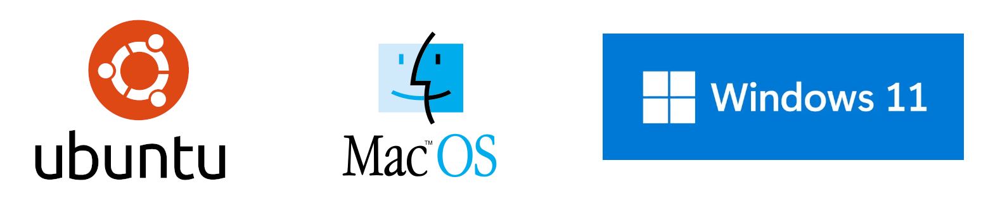

# Sistema Operativo

Un Sistema Operativo (OS - _Operating System_) es el software básico intermediario entre el usuario del ordenador y el [_hardware_](https://es.wikipedia.org/wiki/Hardware). Lo podemos definir como el sistema que gestiona todos los recursos de la máquina y permite que otros programas puedan ejecutarse.



Estas son algunas de las funciones clave de un sistema operativo:

1. **Gestión de recursos**: El sistema operativo controla y asigna los recursos como la memoria, el tiempo de procesador, el espacio en disco y los periféricos (impresora, teclado, ratón, etc.) asegurando que cada programa reciba lo que necesita para funcionar correctamente.

2. **Interfaz de usuario**: Proporciona una interfaz, como interfaces gráficas de usuario ([GUI](https://es.wikipedia.org/wiki/Interfaz_gr%C3%A1fica_de_usuario)) o interfaces de línea de comandos ([CLI](https://es.wikipedia.org/wiki/Interfaz_de_l%C3%ADnea_de_comandos)), por medio de los cuales los usuarios podemos interactuar con la máquina. Por ejemplo, cuando utilizamos Windows, macOS o Linux con su entorno gráfico, estamos usando una GUI que nos permite abrir programas, mover o copiar archivos, y realizar otras tareas con clics o movimientos del ratón en lugar de comandos de texto.

3. **Administración de archivos**: El sistema operativo ayuda a organizar, almacenar, recuperar y gestionar datos en los distintos dispositivos de almacenamiento (discos duros, memorias usb, etc.), permitiéndonos crear o gestionar directorios y archivos.

4. **Seguridad y acceso**: Protege la información almacenada en la computadora controlando quién puede acceder a qué recurso o información a través de cuentas de usuarios y permisos.

5. **Comunicación entre software y hardware**: Permite que las aplicaciones (procesadores de texto, navegadores web, juegos, etc.) se comuniquen con el hardware sin necesidad de conocer todos los detalles técnicos del hardware.

6. **Gestión de tareas**: Coordina y maneja las diversas tareas que se ejecutan al mismo tiempo, asegurando que no interfieran entre sí y que el rendimiento de la computadora sea el óptimo.

> **Nota**: Desde HACK A BOSS recomendamos el uso de Ubuntu en su última versión estable (LTS) como sistema operativo. Ubuntu es una distribución de Linux conocida por su estabilidad y seguridad.
>
> Conocer Linux está valorado en el ámbito laboral, muchas empresas prefieren Linux por su flexibilidad y personalización, además de ser una plataforma ideal para entornos de servidores y aplicaciones en la nube.

## Actualización el Sistema Operativo

Debemos tratar como tarea importante el mantener nuestro sistema operativo actualizado por varias razones que no solo afectan a la eficiencia de nuestro ordenador, sino que también afectan a su seguridad. Aquí tienes una lista de algunas de las principales razones para mantener siempre actualizado tu sistema operativo:

1. **Seguridad**
   Las actualizaciones del sistema operativo con frecuencia incluyen parches para vulnerabilidades de seguridad. Estas vulnerabilidades pueden ser explotadas por _hackers_ para acceder a tu sistema operativo y robar información personal, mantener el sistema operativo actualizado reduce (que no elimina) el riesgo de sufrir estos ataques.
2. **Rendimiento**
   Las actualizaciones suelen contener mejoras en el rendimiento que pueden hacer que tu sistema funcione más rápido.
3. **Estabilidad**
   Las actualizaciones (_updates_) regularmente corrigen errores o problemas que has sido identificados en versiones anteriores del OS. Estas correcciones pueden resolver problemas de inestabilidad que causan cuelgues del sistema, reinicios inesperados o problemas de compatibilidad con otro software.
4. **Compatibilidad**
   Actualizar tu sistema operativo asegura que seas capaz de ejecutar el último software
   disponible.
5. **Acceso a nuevas funciones**
   Cada nueva actualización de un sistema operativo puede incluir nuevas características o mejoras en la interfaz de usuario que mejoren la experiencia general de uso.

### Actualizar Windows (W10 y W11)

#### Pasos para actualizar Windows 10

1. **Abrir Configuración**
   - Haz clic en el botón de Inicio (icono de Windows) en la esquina inferior izquierda de la pantalla.
   - Selecciona "Configuración", el icono con forma de engranaje.
2. **Ir a Actualización y Seguridad**
   - En la ventana de Configuración, busca y selecciona "Actualización y Seguridad".
3. **Buscar Actualizaciones**
   - En el menú de _Actualización y Seguridad_, asegúrate de estar en la pestaña "Windows Update".
   - Haz clic en "Buscar actualizaciones". Windows automáticamente buscará y te mostrará las actualizaciones disponibles.
4. **Instalar Actualizaciones**
   - Si hay actualizaciones disponibles, Windows ofrecerá la opción de instalarlas. Puede que necesites hacer clic en "Descargar e instalar" para comenzar el proceso.
   - Sigue las instrucciones en pantalla para completar la instalación.
5. **Reiniciar el equipo**
   - Es probable que algunas actualizaciones mayores requieran reiniciar el equipo para completar la instalación. Guarda cualquier trabajo en progreso y haz clic en "Reiniciar ahora" si se te solicita.
6. **Verificar la instalación**
   - Después de reiniciar, puedes volver a _Windows Update_ para verificar que todas las actualizaciones se hayan instalado correctamente.

#### Pasos para actualizar Windows 11

1. **Acceder a Configuración**
   - Haz clic en el botón de Inicio y luego en el icono de Configuración.
2. \*\*Ir a Windows Update
   - En el panel de la izquierda, clica sobre la opción "Windows Update"
3. **Buscar Actualizaciones**
   - Haz clic en "Buscar actualizaciones". Windows 11 comprobará automáticamente si hay actualizaciones disponibles.
4. **Instalar Actualizaciones**
   - Si se encuentran actualizaciones, sigue las instrucciones para descargarlas e instalarlas.
5. **Reiniciar el sistema**
   - Al igual que con Windows 10, algunas actualizaciones requerirán un reinicio. Asegúrate de guardar tu trabajo antes de hacer clic en "Reiniciar ahora".
6. **Confirmar la actualización**
   - Después del reinicio, puedes volver a Windows Update para asegurarte de que no hay más actualizaciones pendientes.

### Actualizar macOS

1. **Abrir Preferencias del Sistema**
   - Haz clic en el ícono de Apple en la esquina superior izquierda de tu pantalla.
   - Selecciona "Preferencias del Sistema" en el menú desplegable.
2. **Acceder a Actualización de Software**
   - En la ventana de Preferencias del Sistema, busca y selecciona "Actualización de Software". macOS automáticamente buscará nuevas actualizaciones disponibles.
3. **Descargar e Instalar Actualizaciones**
   - Si hay actualizaciones disponibles, verás una opción para "Actualizar Ahora" o "Mejorar Ahora" si se trata de una actualización de versión mayor.
   - Haz clic en este botón para comenzar la descarga. Dependiendo de tu conexión a internet y el tamaño de la actualización, esto podría tomar algún tiempo.
4. **Seguir las instrucciones en pantalla**
   - Una vez descargada la actualización, se te pedirá que reinicies tu Mac para completar la instalación. Sigue todas las instrucciones en pantalla y asegúrate de no apagar tu computadora durante el proceso de instalación.
5. **Verificar la instalación**
   - Después del reinicio, tu Mac debería estar actualizado. Puedes verificar esto volviendo a "Preferencias del Sistema" > "Actualización de Software" para confirmar que estás corriendo la última versión.

> **Actualizaciones Automáticas**: Puedes activar las actualizaciones automáticas en la misma ventana de "Actualización de Software" para que tu Mac se mantenga actualizado sin necesidad de tu intervención manual. Simplemente marca la opción "Mantener mi Mac actualizado automáticamente".

### Actualizar Ubuntu

1. **Actualizar los paquetes existentes**
   - Abre una terminal.
   - Ejecuta el siguiente comando para actualizar la lista de todos los paquetes de tu sistema a la última versión disponible en tus repositorios actuales:
   ```shell
   sudo apt update
   ```
   - Una vez actualizada la lista ejecuta el siguiente comando para instalar las actualizaciones disponibles:
   ```shell
   sudo apt upgrade
   ```
2. **Reiniciar el sistema**
   - Una vez completadas las actualizaciones, es posible que necesites reiniciar tu sistema para completar el proceso de instalación de algunos componentes. Si se te solicita, hazlo para que los cambios tengan efecto.

> **Nota**: El comando `sudo apt update` debemos realizarlo siempre que queramos instalar una nueva aplicación, garantizando que el sistema está actualizado, reduciendo la posibilidad de conflictos por versiones de paquetes desactualizadas.

También existe la opción de actualizar nuestro Ubuntu desde el Entorno gráfico, para ello, desde el Escritorio, debemos desplegar la lista de aplicaciones haciendo clic en el cuadrado de 9 puntos que se encuentra en la esquina inferior izquierda. Localiza una aplicación llamada `Software Updater`. Ejecútala y deja que haga su trabajo. Esto puede llevar algo de tiempo si es la primera vez.
